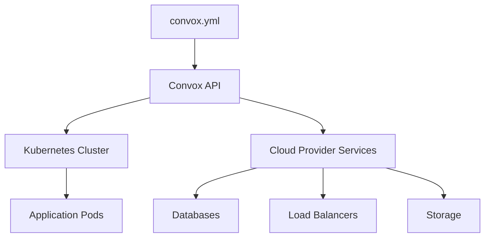

# Architecture

Convox is an open-source Platform as a Service (PaaS) built on Kubernetes. This page explains how Convox works under the hood, its core components, and how it simplifies cloud infrastructure management.

## Overview

Convox provides a simple abstraction layer on top of Kubernetes and cloud provider services. Instead of managing complex Kubernetes manifests, Terraform configurations, and cloud-specific resources, you define your entire application in a single `convox.yml` manifest.



## Core Architecture

### The Rack

A **Rack** is the foundational component of Convox. It's a self-contained Kubernetes-based platform installation running on your cloud provider.

<Info>
Think of a Rack as your personal PaaS. It includes all the infrastructure needed to build, deploy, and run applications.
</Info>

#### Rack Components

Each Rack consists of:

- **Kubernetes Cluster**: The orchestration layer (EKS, GKE, DOKS, or AKS)
- **Convox API**: The control plane that manages deployments and resources
- **Build Infrastructure**: Container image building and registry
- **Networking**: Load balancers, ingress controllers, and DNS
- **Storage**: Persistent volumes and object storage
- **Monitoring**: Metrics collection and log aggregation

```yaml Rack Installation Example
$ convox rack -r production
Name      production
Provider  aws
Router    router.0a1b2c3d4e5f.convox.cloud
Status    running
Version   3.0.0
```

### Multi-Rack Architecture

Most organizations use multiple Racks to separate environments:

<CardGroup cols={3}>
  <Card title="Development" icon="laptop-code">
    **Local Rack**
    
    Runs on developer workstations using Docker Desktop or Minikube. Nearly identical to production.
  </Card>
  
  <Card title="Staging" icon="flask">
    **Cloud Rack**
    
    Test environment with production-like configuration. Used for QA and integration testing.
  </Card>
  
  <Card title="Production" icon="rocket">
    **Cloud Rack**
    
    Live environment serving real users. Configured for high availability and performance.
  </Card>
</CardGroup>

<Tip>
Racks are completely isolated from each other. A misconfiguration in staging can't affect production.
</Tip>

## Application Architecture

### The App Primitive

An **App** is a logical container for your application and its infrastructure dependencies. Apps are atomic units - all components are deployed together as a single **Release**.

```yaml convox.yml Example
environment:
  - RAILS_ENV=production
  - SECRET_KEY_BASE

resources:
  database:
    type: postgres
    options:
      storage: 100
  cache:
    type: redis

services:
  web:
    build: .
    command: bundle exec rails server
    port: 3000
    health: /health
    resources:
      - database
      - cache
  worker:
    build: .
    command: bundle exec sidekiq
    resources:
      - database
      - cache

timers:
  cleanup:
    schedule: "0 3 * * *"
    command: bundle exec rake cleanup
    service: worker
```

### Services

**Services** are horizontally-scalable collections of processes. Each service maps to a Kubernetes Deployment.

#### Service Features

- **Horizontal Scaling**: Static count or autoscaling based on CPU/memory
- **Rolling Updates**: Zero-downtime deployments
- **Health Checks**: Automatic restart of unhealthy processes
- **Load Balancing**: Automatic HTTPS load balancer with SSL certificates
- **Service Discovery**: Internal DNS for service-to-service communication

```yaml Service Configuration
services:
  web:
    build: .
    port: 3000
    health:
      path: /health
      interval: 5
      timeout: 3
    scale:
      count: 2-10
      targets:
        cpu: 70
        memory: 80
    deployment:
      minimum: 50  # Keep at least 50% available during updates
      maximum: 200 # Can surge to 200% during rollout
```

**Behind the Scenes**: Convox creates Kubernetes Deployments, Services, and Ingress resources. Health checks map to readiness and liveness probes.

### Resources

**Resources** are managed infrastructure components that your services depend on - databases, caches, queues, etc.

#### Resource Provisioning

Convox automatically:

1. **Provisions** the resource using cloud-native managed services (RDS, ElastiCache, Cloud SQL, etc.)
2. **Configures** connection parameters, credentials, and security groups
3. **Injects** connection URLs as environment variables into linked services
4. **Manages** backups, updates, and monitoring

```yaml Resources Example
resources:
  database:
    type: postgres
    options:
      storage: 200        # GB of storage
      durable: true       # Enable automated backups
      version: "14"       # Postgres version
  queue:
    type: redis
    options:
      node: cache.m5.large
```

#### Supported Resource Types

<CardGroup cols={2}>
  <Card title="Postgres" icon="database">
    PostgreSQL databases with PostGIS support
  </Card>
  
  <Card title="MySQL / MariaDB" icon="database">
    MySQL and MariaDB databases
  </Card>
  
  <Card title="Redis" icon="server">
    Redis for caching and job queues
  </Card>
  
  <Card title="Memcached" icon="memory">
    In-memory key-value store
  </Card>
</CardGroup>

<Info>
Resources are automatically linked to services. Connection URLs are injected as environment variables like `DATABASE_URL`.
</Info>

### Builds and Releases

#### The Build Process

When you run `convox deploy`, here's what happens:

<Steps>
  <Step title="Package Source">
    Your code is packaged and uploaded to Convox
  </Step>
  
  <Step title="Build Container Images">
    Dockerfiles are built for each service. Images are pushed to your cloud provider's container registry (ECR, GCR, etc.)
  </Step>
  
  <Step title="Create Release">
    A Release is created combining the Build with current environment variables
  </Step>
  
  <Step title="Rolling Update">
    Kubernetes performs a rolling update, ensuring zero downtime
  </Step>
</Steps>

```bash Build Output
$ convox deploy
Packaging source... OK
Uploading source... OK
Starting build... OK
Authenticating 782231114432.dkr.ecr.us-east-1.amazonaws.com: Login Succeeded
Building: .
Step 1/5 : FROM ruby:3.2-alpine
Step 2/5 : WORKDIR /app
Step 3/5 : COPY Gemfile* ./
Step 4/5 : RUN bundle install
Step 5/5 : COPY . .
Running: docker push 782231114432.dkr.ecr.us-east-1.amazonaws.com/convox:web.BUTQJQRIWUZ
Promoting RSBSSIPZIEF...
Rolling update complete
```

#### Release Management

**Releases** are immutable. Each deployment creates a new Release that includes:

- **Build ID**: Reference to container images
- **Environment**: Snapshot of environment variables at deployment time
- **Manifest**: The `convox.yml` configuration
- **Timestamp**: When the release was created

```bash
$ convox releases -a myapp
ID           STATUS  BUILD        CREATED        DESCRIPTION
RSBSSIPZIEF  active  BUTQJQRIWUZ  2 minutes ago  deploy
RYCWZIXLKQT          BVXIJQDCELS  30 minutes ago deploy
RABCDEFGHIJ          BZYXWVUTSRQ  2 hours ago    env add FOO
```

<Tip>
**Instant Rollbacks**: Since releases are immutable, rolling back is just a matter of promoting a previous release. No rebuild required.
</Tip>

### Timers

**Timers** run one-off processes on a schedule using Kubernetes CronJobs.

```yaml Cron Jobs
timers:
  cleanup:
    schedule: "0 3 * * *"  # Daily at 3 AM
    command: bundle exec rake cleanup
    service: worker
  report:
    schedule: "0 0 * * MON"  # Weekly on Monday
    command: python generate_report.py
    service: web
```

## Networking Architecture

### Load Balancing

Convox automatically provisions cloud load balancers for services that expose ports:

- **AWS**: Application Load Balancer (ALB) or Network Load Balancer (NLB)
- **GCP**: Google Cloud Load Balancer
- **Azure**: Azure Load Balancer
- **Digital Ocean**: Digital Ocean Load Balancer

#### Automatic SSL

SSL certificates are automatically provisioned and renewed:

- **Convox Domains**: Automatic SSL via Let's Encrypt for `*.convox.cloud` domains
- **Custom Domains**: Automatic certificate management via cert-manager

```yaml Custom Domain Example
services:
  web:
    domain: www.example.com
    port: 3000
```

### Service Discovery

Services can communicate internally using DNS:

```bash
# From any service, reach another service:
curl http://api.myapp:3000/endpoint
```

Convox creates Kubernetes Services with ClusterIP type for internal routing.

## Storage Architecture

### Persistent Volumes

Services can mount persistent volumes for stateful data:

```yaml Volumes Example
services:
  web:
    build: .
    volumes:
      - /var/app/uploads  # Persistent storage
```

**Behind the Scenes**: Maps to Kubernetes PersistentVolumeClaims using cloud provider storage classes (EBS, Persistent Disk, Azure Disk).

### Object Storage

The **Object** primitive provides S3-compatible blob storage:

```yaml
resources:
  uploads:
    type: object

services:
  web:
    resources:
      - uploads
```

Access via the injected `UPLOADS_URL` environment variable.

## Deployment Strategies

### Rolling Updates

Convox uses Kubernetes rolling updates by default:

- Old pods continue serving traffic
- New pods are created and health checked
- Traffic gradually shifts to new pods
- Old pods are terminated
- Zero downtime

```yaml Deployment Control
services:
  web:
    deployment:
      minimum: 50   # Keep at least 50% of pods available
      maximum: 200  # Can have up to 200% during rollout
```

### Health Checks

Convox supports multiple health check types:

```yaml Health Check Types
services:
  web:
    # Readiness: Is the pod ready to receive traffic?
    health:
      path: /health
      interval: 5
      timeout: 3
      grace: 10  # Wait 10s before checking
    
    # Liveness: Should the pod be restarted?
    liveness:
      path: /liveness
      interval: 10
      timeout: 5
      failureThreshold: 3
```

## Cloud Provider Integration

### Infrastructure as Code

Convox uses Terraform to provision cloud infrastructure:

- **Kubernetes Cluster**: EKS, GKE, DOKS, or AKS
- **Networking**: VPC, subnets, security groups
- **Storage**: Persistent volumes, object storage
- **IAM**: Roles and policies for secure access

<Warning>
Convox manages infrastructure via Terraform. Avoid making manual changes to Rack infrastructure as they may be overwritten.
</Warning>

### Resource Mapping

How Convox resources map to cloud services:

| Convox Resource | AWS | GCP | Azure |
|-----------------|-----|-----|-------|
| postgres | RDS PostgreSQL | Cloud SQL | Azure Database |
| mysql | RDS MySQL | Cloud SQL | Azure Database |
| redis | ElastiCache | Memorystore | Azure Cache |
| object | S3 | Cloud Storage | Blob Storage |

## Security Architecture

### Network Isolation

- Services run in private subnets
- Only load balancers are publicly accessible
- Resources (databases) are not internet-accessible
- Security groups/firewall rules enforced at cloud level

### Secrets Management

Environment variables are encrypted at rest:

```bash
$ convox env set DATABASE_PASSWORD=secret123 -a myapp
Setting DATABASE_PASSWORD... OK
Release: RNEWRELEASE (promoting)
```

<Info>
Changing environment variables creates a new release and triggers a rolling deployment.
</Info>

### RBAC Integration

Convox integrates with cloud provider IAM:

- **AWS**: IAM roles and policies
- **GCP**: Service accounts
- **Azure**: Managed identities

## Monitoring and Observability

### Logging

Convox aggregates logs from all services:

```bash
$ convox logs -a myapp
2026-03-06T10:30:00 web/web-abc123 Started GET "/" for 1.2.3.4
2026-03-06T10:30:00 worker/worker-xyz789 Processing job 12345
```

Logs are streamed from Kubernetes pods and can be forwarded to external services (Datadog, Splunk, etc.).

### Metrics

Convox collects resource metrics:

- CPU and memory usage per service
- Request counts and latencies (via load balancer)
- Pod restart counts
- Autoscaling decisions

## Scalability

### Horizontal Pod Autoscaling

Convox uses Kubernetes HPA for automatic scaling:

```yaml
services:
  web:
    scale:
      count: 2-10
      targets:
        cpu: 70
        memory: 80
```

When CPU or memory exceeds thresholds, Kubernetes automatically adds pods.

### Cluster Autoscaling

Cloud providers automatically add nodes when pod capacity is reached:

- **AWS**: EKS with Cluster Autoscaler
- **GCP**: GKE autoscaling node pools
- **Azure**: AKS cluster autoscaler

## Development Workflow

### Local Development Rack

Run a complete Rack locally:

```bash
$ convox rack install local
```

Uses Docker Desktop or Minikube. Nearly identical to production environment.

### Build and Test Locally

```bash
# Build locally without deploying
$ convox build

# Run services locally
$ convox start

# Run one-off commands
$ convox run web bundle exec rspec
```

## Summary

Convox architecture provides:

<CardGroup cols={2}>
  <Card title="Simplicity" icon="feather">
    Single manifest defines everything. No Kubernetes YAML complexity.
  </Card>
  
  <Card title="Portability" icon="arrows-left-right">
    Same workflow across AWS, GCP, Azure, and Digital Ocean.
  </Card>
  
  <Card title="Kubernetes Power" icon="dharmachakra">
    Built on K8s for reliability, scalability, and ecosystem compatibility.
  </Card>
  
  <Card title="Production Ready" icon="shield-check">
    Zero-downtime deploys, instant rollbacks, automatic SSL, and more.
  </Card>
</CardGroup>

## Learn More

<CardGroup cols={3}>
  <Card title="Primitives Reference" icon="cubes" href="/reference/primitives">
    Deep dive into Racks, Apps, Services, and Resources
  </Card>
  
  <Card title="convox.yml Spec" icon="file-code" href="/configuration/convox-yml">
    Complete manifest configuration reference
  </Card>
  
  <Card title="Deployment Guide" icon="rocket" href="/deployment/deploying-changes">
    Best practices for deploying applications
  </Card>
</CardGroup>